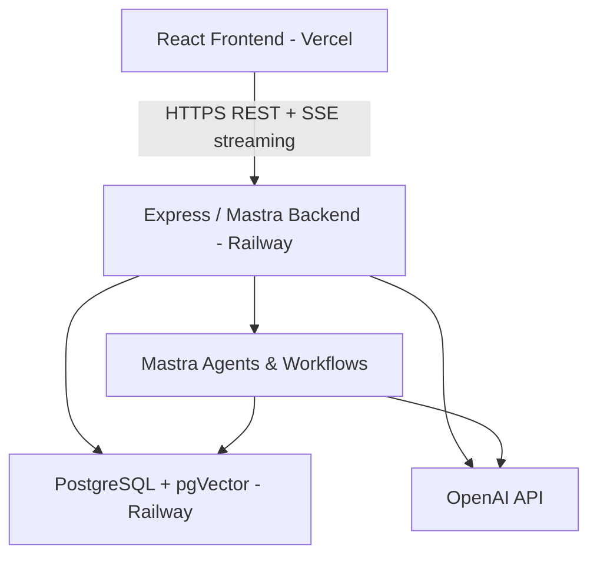

# AI Job Coach 🤖

An AI-powered full-stack app that tailors your CV to any job description, generates interview questions with model answers, and runs a live Socratic practice interview — all in real time.

> Built with Mastra.ai, React, Node.js, TypeScript, Prisma, and PostgreSQL.

***

## What it does

Paste a job description and your CV — the app does the rest:

- **CV Tailoring Agent** — reads your CV and the job description, rewrites your bullet points to match the role
- **Interview Prep Workflow** — multi-step Mastra workflow that extracts key competencies and generates behavioural and technical questions with model answers
- **Live Practice Agent** — streams a Socratic mock interview back to you in real time via a React chat UI
- **Memory** — stores your sessions so you can revisit past interviews and track your progression
- **RAG-powered CV retrieval** — your CV is chunked, embedded, and retrieved by the tailoring agent for contextual rewrites

***

## Architecture



| Layer | Technology |
|-------|-----------|
| Frontend | React, Vite, TypeScript, AI SDK UI |
| Backend | Node.js, Express, Mastra.ai |
| Agents | Mastra agents, tools, workflows, memory |
| Database | PostgreSQL, Prisma ORM, pgVector |
| AI | OpenAI GPT-4o, text-embedding-3-small |
| Deployment | Railway (backend), Vercel (frontend) |

***

## Features

### CV Tailoring Agent
Uploads and embeds your CV using Mastra RAG (`MDocument`). When given a job description, the agent retrieves the most relevant CV sections via vector similarity search and rewrites them to match the role's requirements.

### Interview Prep Workflow
A 3-step Mastra workflow:
1. Extract key competencies from the job description
2. Generate behavioural and technical questions in parallel
3. Produce model answers for each question

### Live Practice Interview Agent
A streaming Socratic agent that interviews you live. Uses Mastra Memory (LibSQL + pgVector) scoped by `resourceId` (user) and `threadId` (session), so it remembers everything you've said across turns.

### Session History
All prep sessions are persisted to PostgreSQL via Prisma and retrievable via REST endpoints, so users can revisit past interview prep.

***

## Tech stack

```
React + Vite + TypeScript      — frontend
Mastra.ai                      — agent framework (agents, tools, workflows, memory)
Node.js + Express              — backend server
Prisma ORM                     — database access layer
PostgreSQL + pgVector          — relational + vector storage
OpenAI GPT-4o                  — LLM
AI SDK (Vercel)                — streaming UI hooks (useChat)
Docker                         — containerised backend
Railway                        — backend hosting
Vercel                         — frontend hosting
Vitest                         — unit + integration tests
Mastra Evals                   — agent quality evaluation
```

***

## Project structure

```
/
├── backend/                  # Mastra + Express backend
│   ├── src/
│   │   ├── agents/           # CV analyser, practice interview, CV tailoring agents
│   │   ├── tools/            # JD scorer, CV retriever, LinkedIn scraper tools
│   │   ├── workflows/        # Interview prep workflow
│   │   ├── db/               # Prisma client singleton
│   │   └── mastra/           # Mastra instance, memory, RAG config
│   ├── prisma/
│   │   └── schema.prisma
│   └── Dockerfile
├── frontend/                 # React + Vite frontend
│   ├── src/
│   │   ├── components/       # ChatInterface, JobDescriptionForm, ToolCallCards
│   │   └── hooks/
│   └── index.html
└── docker-compose.yml        # Local development only
```

***

## Running locally

### Prerequisites
- Node.js 22+
- Docker + Docker Compose
- OpenAI API key

### Setup

```bash
# Clone the repo
git clone https://github.com/your-username/ai-job-coach.git
cd ai-job-coach

# Start the database locally
docker-compose up -d

# Backend
cd backend
cp .env.example .env
# Add your OPENAI_API_KEY and DATABASE_URL to .env
npm install
npx prisma migrate dev
npm run dev

# Frontend (new terminal)
cd frontend
npm install
npm run dev
```

Frontend runs at `http://localhost:5173`, Mastra backend at `http://localhost:4111`, Mastra Studio at `http://localhost:4111/studio`.

***

## Environment variables

### Backend (`backend/.env`)

```
OPENAI_API_KEY=
DATABASE_URL=
NODE_ENV=development
PORT=4111
```

### Frontend (`frontend/.env`)

```
VITE_API_URL=http://localhost:4111
```

***

## Deployment

| Service | Platform | Notes |
|---------|----------|-------|
| Backend | Railway | Dockerised, root directory set to `/backend` |
| Frontend | Vercel | Root directory set to `/frontend`, `VITE_API_URL` set to Railway domain |
| Database | Railway PostgreSQL | pgVector extension enabled |

***

## Testing

```bash
cd backend

# Unit + integration tests
npm test

# Coverage
npm run test:coverage

# Evals (agent quality scores)
npx mastra eval
```

Evals are configured with relevance, faithfulness, and completeness thresholds. A score below 0.7 on relevance fails the eval run.

***

## Live demo

- **App:** https://ai-job-coach-monorepo.vercel.app
- **API:** https://ai-job-coach-monorepo-production.up.railway.app

A demo mode is available with a pre-seeded CV and job description — click **Try Demo** on the landing page to test without uploading your own CV.

***

## What this demonstrates

This project was built as a portfolio piece to showcase:

- **Mastra.ai agent architecture** — agents, tools, workflows, and memory working together
- **RAG pipeline** — CV chunked, embedded with `text-embedding-3-small`, retrieved with pgVector
- **Streaming UI** — Server-Sent Events from Mastra piped to React via AI SDK `useChat`
- **Production deployment** — Dockerised Node backend on Railway, React frontend on Vercel
- **Testing discipline** — Vitest unit tests, Mastra evals with quality thresholds
- **Full-stack TypeScript** — end-to-end types from Prisma through Mastra to React

***

*Built with [Mastra.ai](https://mastra.ai) · React · Node.js · TypeScript*
